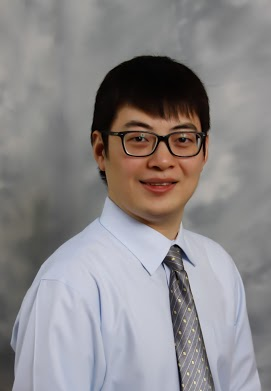

<h4>About me</h4>

  

     

        
        	

    

  
    
        

            Hao Harry Feng 
            <a href="https://case.edu/medicine/pqhs/">Department of Population &amp; Quantitative Health Sciences</a> 
            <a href="https://case.edu/medicine/">School of Medicine</a> 
            <a href="https://case.edu/">Case Western Reserve University</a> 
            10900 Euclid Avenue 
            SOM / Room G82T 
            Cleveland, OH 44106 
            USA  

            

            Email: <code>hxf155@case.edu</code> 
             <a href="https://case.edu/medicine/pqhs/about/people/primary-faculty/hao-harry-feng/">My official webpage at CWRU</a> 
      
        

       
        

    

---

### Bio

I am is a tenure-track assistant professor in biostatistics at the 
[Department of Population &amp; Quantitative Health Sciences](https://case.edu/medicine/pqhs/)
at Case Western Reserve University School of Medicine and an associate member at [Case Comprehensive Cancer Center (Case CCC)](https://case.edu/cancer/).

I obtained my Ph.D. degree (2019) in Biostatistics from [Emory University](https://www.sph.emory.edu/departments/bios/index.html) under the guidance of
professor [Hao Wu](http://www.haowulab.org/). Before that, I received my MSPH degree (2013) in biostatistics from Emory University and my BS degree (2011)
in biosciences from the [University of Science and Technology of China](https://en.ustc.edu.cn/). 

I am a statistician focusing on problems in bioinformatics. Developing statistical methods for high-throughput _omics_ data is a major component of my research. I (co-)developed statistical methods [DSS](http://bioconductor.org/packages/release/bioc/html/DSS.html) to 
identify Differentially Methylated Regions (DMR) in Bisulfite-sequencing (BS-seq) data,
[InfiniumPurify](https://cran.rstudio.com/web/packages/InfiniumPurify/index.html) to identify cancer subtypes using DNA methylation microarray data, [cfDNAmethy](https://github.com/haoharryfeng/cfDNAmethy) to deconvolute cell-free DNA methylation signal in plasma using liquid biopsy. I collaborate closely with physicians and wet-lab researchers on various 
projects including cancer, virus, trauma, epidemiology and neurodegenerative disease studies. 

<!-- [curriculum vitae ](Feng_cv.pdf)  -->
[orcid](https://orcid.org): [0000-0003-2243-9949](https://orcid.org/0000-0003-2243-9949) 
[Google Scholar](https://scholar.google.com/citations?user=YGFvJjwAAAAJ&hl=en) 
[GitHub](https://github.com/haoharryfeng) 
      

