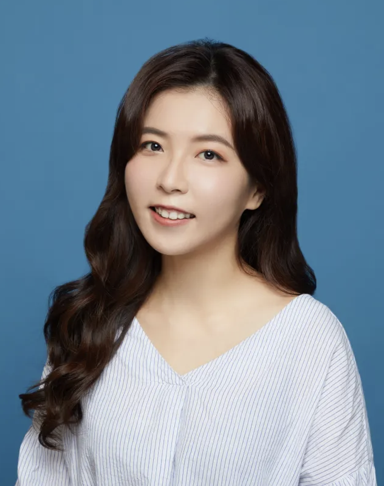

### PI

  

     

        
        	

   
    
        

            <b>Ziyi Li</b> 
			Assistant Professor  
      <a href="https://ziyili20.github.io/PI.html">About the PI</a> 
   
   
        

    

---

### PhD Students

  

     

        
        	

    
        

            <b>Peng (Jason) Yang</b> 
            Rice Ph.D. student in Statistics  
            Research interests: High-throughput data analysis, clinical trial design   
            Co-advisee of <a href="https://faculty.mdanderson.org/profiles/ying_yuan.html">Dr. Ying Yuan</a> and me  
       
        

    

-

  

     

        
        	

    
        

            <b>Ruoxing Li</b> 
            Ph.D. student in Biostatstics  
            Research interests: high-throughput data analysis; EHR data analysis; biostatistics  
            Co-advisee of me and <a href="https://faculty.mdanderson.org/profiles/jianjun_zhang.html">Dr. Jianjun Zhang</a>  
       
        

    

-

  

     

        
        	

    
        

            <b>Yue Lyu</b> 
            Ph.D. student in Biostatistics   
            Research interests: Statistical modeling, single cell   
      Co-advisee of me and <a href="https://faculty.mdanderson.org/profiles/steven_lin.html">Dr. Steven Lin</a>   
       
        

    

-

  

     

        
        	

    
        

            <b>Chenxuan Zang</b> 
            Ph.D. student in Biostatistics    
            Research interests: Statistical modeling, Spatial transcriptomics   
      
      Co-advisee of <a href="https://faculty.mdanderson.org/profiles/peng_wei.html">Dr. Peng Wei</a> and me   
       
        

    

-

  

     

        
        	

    
        

            <b>Lan Shui</b> 
            GSBS Ph.D. student in Biostatistics  
            Research interests: Statistical modeling, Spatial Transcriptomics   
            Co-advisee of <a href="https://faculty.mdanderson.org/profiles/liang_li.html">Dr. Liang Li</a> and me  
       
        

    

-

  

     

        
        	

    
        

            <b>Li-Ting Ku</b> 
            GSBS Ph.D. student in Biostatistics  
            Research interests: Statistical modeling, Spatial Transcriptomics   
            Co-advisee of <a href="https://faculty.mdanderson.org/profiles/liang_li.html">Dr. Liang Li</a> and me  
       
        

    

---

### Lab Alumni

<b>Yizhuo Wang</b> PhD 2023 Edwards LifeSciences   

<b>Srijata Samanta</b> Postdoc 2022 Bristol Myers Squibb   

            <b>Sunyi Chi</b> Rotation GSBS Ph.D. student 2020 Spring   
            <b>Yidan Huyan</b> UT Health Ph.D. student 2022 Fall   
      
    

