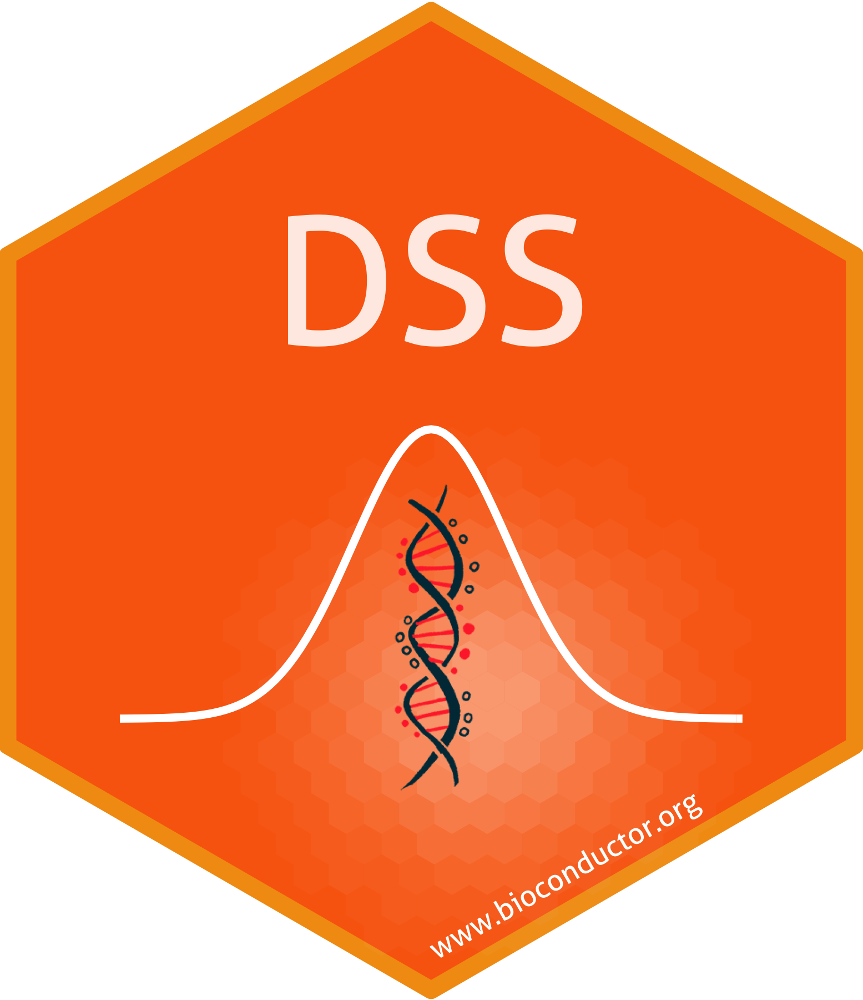

I develop and maintain freely-available, open-source software packages in R/Bioconductor/CRAN/GitHub to analyze high-throughput genomics 
data. They are available through [R cran](https://cran.r-project.org/), [Bioconductor](https://www.bioconductor.org/) 
or [GitHub](https://github.com/haoharryfeng). 

  
  
 	
<!--   		 	-->

---------------

- <a style="color: white;" class="btn btn-primary" href="https://bioconductor.org/packages/release/bioc/html/DSS.html">DSS</a> 
  <a style="color: black;" class="btn" href="http://bioconductor.org/packages/stats/bioc/DSS/">Usage Stats</a> 
   
  (**D**ispersion **S**hrinakge for **S**equencing): differential analysis for 
  count-based sequencing data. It detectes differentially expressed genes (DEGs) from RNA-seq, and differentially methylated regions (DMRs) from 
  bisulfite sequencing (BS-seq) data. Available on [Bioconductor](https://bioconductor.org/packages/release/bioc/html/DSS.html).

- <a  style="color: white;" class="btn btn-primary" href="https://bioconductor.org/packages/NeuCA/">NeuCA</a>
  <a style="color: black;" class="btn" href="http://bioconductor.org/packages/stats/bioc/NeuCA/">Usage Stats</a> 
   
  (**Neu**ral-network based **C**ell type **A**nnotation): R/Bioconductor package for single-cell RNA-seq data cell type annotation, using neural-network approaches. NeuCA is flexible and adjust the classification method it will adopt, depending on cell types' correlation level. Currently available on [Bioconductor](https://bioconductor.org/packages/NeuCA/). 

- <a  style="color: white;" class="btn btn-primary" href="https://www.bioconductor.org/packages/ISLET/">ISLET</a>
  <a style="color: black;" class="btn" href="http://bioconductor.org/packages/stats/bioc/ISLET/">Usage Stats</a> 
   
  ISLET (**I**ndividual-**S**pecific ce**L**l typ**E** referencing **T**ool) can deconvolute mixture samples and obtain the individual-specific and cell-type-specific reference panels, for repeatedly measured subjects' bulk data. Available on [Bioconductor](https://www.bioconductor.org/packages/ISLET/).
				       
		       
- <a  style="color: white;" class="btn btn-primary" href="https://CRAN.R-project.org/package=InfiniumPurify">InfiniumPurify</a>  
  R CRAN package for the estimation and adjustment for tumor purity in cancer methylation data analysis, available on [R CRAN](https://CRAN.R-project.org/package=InfiniumPurify).
		    
- <a  style="color: white;" class="btn btn-primary" href="https://github.com/haoharryfeng/cfDNAmethy">cfDNAmethy</a>  
  Reference-free and reference-based models for disease prediction by cell-free DNA methylation, available on [GitHub](https://github.com/haoharryfeng/cfDNAmethy).

